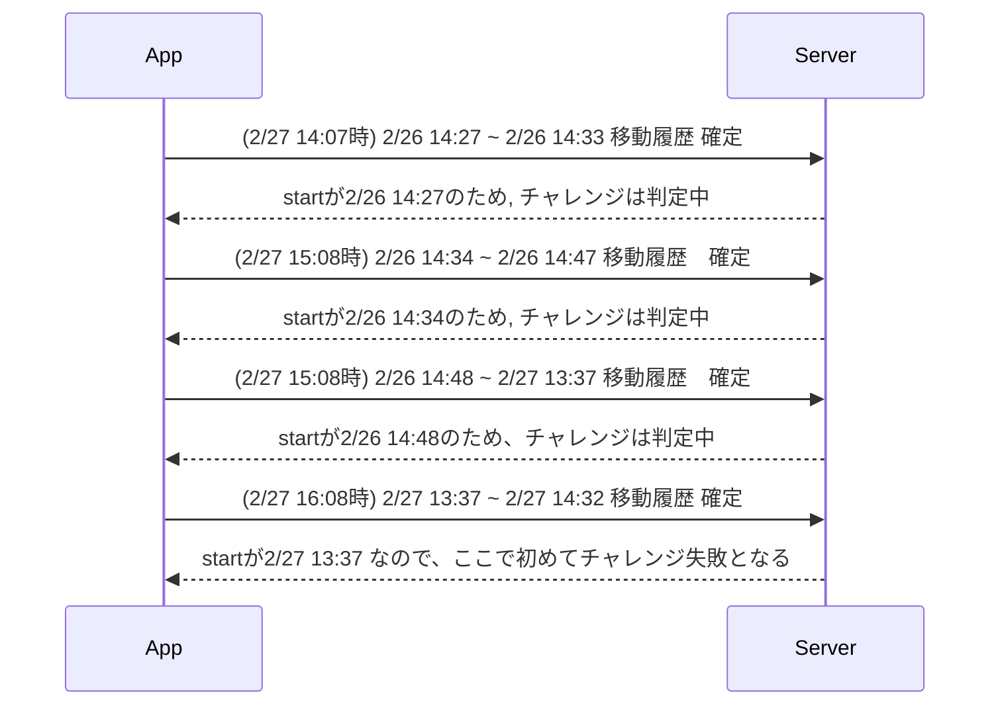

> ここの部分についてもう少し具体的に教えて頂けないでしょうか？  
現在の移動情報の開始時間を基準というところですが、これは現在の移動が15:01から開始されているのでここを基準にしてどのようなタイミングでチャレンジが判定されるのでしょうか？  
移動ログとしては2/26日分は全て確定してるのでその時点でチャレンジが判定されると思ったのですが、そうではなくラグがあると言うことでしょうか？

言葉足らずになってしまいわかりにくい表現になってしまいました。すみません。

> > しかし、現在(の実装では)移動情報の開始時間を基準にして判定を行っているため、22h49minの滞在が確定情報として入ったとしてもチャレンジは失敗判定とならないです。

